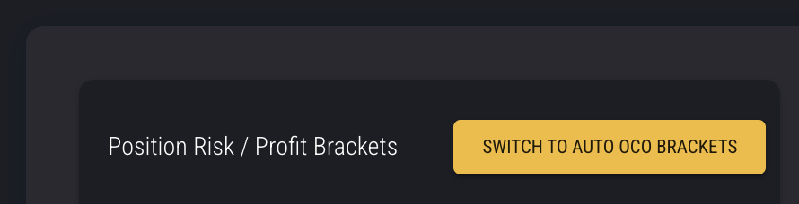

# 🚀 Tick Trader — current architecture overview

[](#)
[](https://www.rust-lang.org/)
[](https://tokio.rs/)
[](https://crates.io/crates/rkyv)
[](https://crates.io/crates/rust_decimal)
[](#)
[](crates/adapters/projectx)
[-95a5a6)](#)
[-95a5a6)](https://www.databento.com)
[](https://www.postgresql.org/)


[](https://buymeacoffee.com/BurnOutTrader)
[](https://github.com/sponsors/BurnOutTrader)

> Note: This project is experimental and under active development. Interfaces may change and breaking updates can occur without notice. Use at your own risk.

## Live trading status and near‑term roadmap

The engine can place live orders and is intended strictly for testing and evaluation. Do not use in production.

- Surface EngineHandle helpers via top‑level exports
- Move non-strategy functions and objects into features
- Live consolidator warm up and cache
- Automatic switching of consolidator types to live feed types post warm up
- cross provider Symbol mapping, to allow warming up data feed from alternative provider history (eg: warm up MBP10 from databento, then switch to live data from ProjectX)
- Expand automated tests and CI coverage
- Adding rithmic + data bento at a later stage.
- Support for publishing strategy signals on the bus will be implemented last
- refactor down engine code into more manageable functions.
- complete the automatic historical data update functions.
- capture server, to capture live tick, mbp10, or quote data for specified provider instruments
- Considering mapping projectX to be 'front month only' i.e continuous contract "MNQ.C.1"


## ✨ Brief overview
- 💻 Platforms: macOS (tested) and Linux (experimental) are supported out of the box.
- 🧠 Strategies: run multiple strategies as separate processes/binaries.
- 🖧 Server: runs as a separate service; communicates over UDS and SHM; automatically starts/stops adapters (e.g., ProjectX) to minimize resource usage.
- 🔌 Adapters: multiple instances of the same adapter can run concurrently (e.g., ProjectX Tradeify + Topstep).
- 🏢 ProjectX tenants: All known firms supported. reach out if one doesn't connect, due to any error.
- 🚧 Status: work in progress — the architecture is largely stabilized, but features are still evolving.
- 📡 Support for publishing/sharing strategy signals/insights on the bus will be implemented last
- 🛅 PostgreSQL + Docker Database for storage and query of historical data by strategies and the server. 
- ⏪ Backtesting: Configurable with dynamic realism models, fill models are configurable. the default fill model can book walk etc. Implementation v1.0, not tested, will likely have some bugs and inaccuracy.
- 🔽 Automatic data downloading and databasing + functions to retrieve historical data from the database for run time analysis.
- 🗜️ Automated consolidator handling, for multiple time frame feeds without duplicating streams.
- 🪏 The server will automatically pull all historical data for all available symbols and resolutions once per day.
  - After the initial daily update, it will only update data for live symbols, prior to warming up strategies.
  - The auto update can be configured in the .env file

### Strategies are straight forward
[Example Strategy](crates/a_strategies/live_accounts_examples/data_test_strategy/src/main.rs)

Just implement the strategy trait
```rust

pub trait Strategy: Send + 'static {
    fn on_start(&mut self, _h: EngineHandle) {}
    fn on_stop(&mut self) {}

    fn on_tick(&mut self, _t: &Tick, _provider_kind: ProviderKind) {}
    fn on_quote(&mut self, _q: &Bbo, _provider_kind: ProviderKind) {}
    fn on_bar(&mut self, _b: &Candle, _provider_kind: ProviderKind) {}
    fn on_mbp10(&mut self, _d: &Mbp10, _provider_kind: ProviderKind) {}

    fn on_orders_batch(&mut self, _b: &OrdersBatch) {}
    fn on_positions_batch(&mut self, _b: &PositionsBatch) {}
    fn on_account_delta(&mut self, _accounts: &[AccountDelta]) {}

    fn on_trades_closed(&mut self, _trades: Vec<Trade>) {}

    fn on_subscribe(&mut self, _instrument: Instrument, _data_topic: DataTopic, _success: bool) {}
    fn on_unsubscribe(&mut self, _instrument: Instrument, _data_topic: DataTopic) {}

    fn accounts(&self) -> Vec<AccountKey> { Vec::new() }
}

/// Just implement the trait
pub struct MyStrategy;

impl Strategy for MyStrategy {
  fn on_start(&mut self, _h: EngineHandle) {}
  fn on_stop(&mut self) {}

  fn on_tick(&mut self, _t: &Tick, _provider_kind: ProviderKind) {}
  fn on_quote(&mut self, _q: &Bbo, _provider_kind: ProviderKind) {}
  fn on_bar(&mut self, _b: &Candle, _provider_kind: ProviderKind) {}
  fn on_mbp10(&mut self, _d: &Mbp10, _provider_kind: ProviderKind) {}

  fn on_orders_batch(&mut self, _b: &OrdersBatch) {}
  fn on_positions_batch(&mut self, _b: &PositionsBatch) {}
  fn on_account_delta(&mut self, _accounts: &[AccountDelta]) {}

  fn on_trades_closed(&mut self, _trades: Vec<Trade>) {}

  fn on_subscribe(&mut self, _instrument: Instrument, _data_topic: DataTopic, _success: bool) {}
  fn on_unsubscribe(&mut self, _instrument: Instrument, _data_topic: DataTopic) {}

  fn accounts(&self) -> Vec<AccountKey> { Vec::new() }
}
```
Then in main
```rust
#[tokio::main]
async fn main() -> anyhow::Result<()> {
    use tracing_subscriber::EnvFilter;
    let filter = EnvFilter::try_from_default_env()
        .unwrap_or_else(|_| EnvFilter::new("info,tt_bus=info,tt_engine=info,projectx.ws=info"));
    tracing_subscriber::fmt()
        .with_env_filter(filter)
        .with_target(true)
        .init();
  
    let addr = std::env::var("TT_BUS_ADDR").unwrap_or_else(|_| "/tmp/tick-trader.sock".to_string());
    let bus = ClientMessageBus::connect(&addr).await?;
    let mut engine = EngineRuntime::new(bus.clone());
  
    // You can build your strategy with any properties you want, this is empty for brevity
    let strategy = MyStrategy {};
    let _handle = engine.start(strategy).await?;

    // Auto shutdown in 1000000 seconds
    sleep(Duration::from_secs(1000000)).await;

    let _ = engine.stop().await?;

    Ok(())
}
```

There are strategy helpers for queries, like portfolio, orders, positions etc, you access these via the engine handle
```rust
fn on_start(&mut self, _h: EngineHandle) {}
```

Your strategy should store this handle after starting 
```rust
pub struct TotalLiveTestStrategy {
    engine: Option<EngineHandle>,
}
impl Strategy for TotalLiveTestStrategy {
    fn on_start(&mut self, h: EngineHandle) {
        // store handle
        self.engine = Some(h.clone());
    }

  fn on_tick(&mut self, t: &Tick, provider_kind: ProviderKind) {
      println!("{:?}", t);
    // then use the handle helper to place orders etc
    let _ = h.unwrap().place_order(
      account.clone(),
      exec_key.clone(),
      tt_types::accounts::events::Side::Buy,
      1,
      OrderType::Market,
      None,
      None,
      None,
      Some("total_live_test".to_string()),
      None,
      None,
    );
  }
}
```

To use stop loss and take profit brackets in ProjectX switch to OCO brackets. (not thoroughly tested) 



## 🔐 Environment and credentials (.env)

- The server and providers load .env automatically. ProviderSessionSpec::from_env scans all environment variables to construct credentials for multiple providers.
- ProjectX keys use the PX_ prefix:
  - `PX_{TENANT}_USERNAME, PX_{TENANT}_APIKEY, optional PX_{TENANT}_FIRM`
  - Example:
    - PX_TOPSTEP_USERNAME=alice
    - PX_TOPSTEP_APIKEY=xxxx
    - PX_TOPSTEP_FIRM=topstep
  - For all available firms and the correct string see: [providers.rs](crates/types/src/providers.rs)
    We build the api configuration from the api string from_env_string()
- Server address:
  - TT_BUS_ADDR defaults to /tmp/tick-trader.sock (macOS) or @tick-trader.sock (Linux abstract). Override in .env or env.
- Database connection:
  - For custom db connections see tick-trader/pg, else the build will automatically use a local docker connection.
## ⚡ Quick start

### 1) Build the workspace:

```bash
cargo build
```

### 2) Initialize the database
🗄️ Database Setup (PostgreSQL + Docker)

This project uses a PostgreSQL instance defined in pg/docker-compose.yml.
It runs a local database named tick_trader with dedicated roles for the server and strategies.

🧰 Prerequisites
•	Docker Desktop (or Docker Engine + Compose plugin)
•	Ports 5432 free locally

```bash
cd pg
cp .env.example .env   
chmod +x init/01-init.sh
docker compose up -d
docker compose logs -f postgres
```

✅ Expected output:

```terminaloutput
PostgreSQL init process complete; ready for start up.
database system is ready to accept connections
tick_trader DB and roles initialized.
```

### 3) Start the server (separate terminal):

```bash
cd server
cargo run -p tt-server
```

### 3) Prepare .env with your provider credentials (ProjectX example):
Warning: do not change db connection unless you are experienced; it should remain a local address.
If you change the DB mapping for the main .env, you will also need to change the docker-compose.yml in tick-trader/pg
```env
PX_TOPSTEP_USERNAME=your_user
PX_TOPSTEP_APIKEY=your_key
PX_TOPSTEP_FIRM=topstep
TT_BUS_ADDR=/tmp/tick-trader.sock
DATABASE_URL=127.0.0.1:5432:5432
```

### 4) Run the test strategy (client) in another terminal:

```bash
cargo run -p crates/a_strategies/examples --bin tt-data_test_strategy
```

## Stop The Database
If you want to stop the database run
```bash
cd pg
docker compose down
```

## ⚠️ Breaking change: half‑open intervals (DB rebuild required)

As of 2025-10-17, bars, queries, and pagination have been standardized to half‑open time windows: [start, end). Bar time_end values are now exact grid boundaries (no legacy “-1 ns”). Database queries uniformly use >= start AND < end.

What this means for you
- Existing databases populated with the old inclusive “end - 1 ns” convention are incompatible. You must rebuild or migrate your DB.
- Fresh setups following the updated code require no extra steps; the schema will be created automatically.

Recommended: rebuild the local Docker Postgres volume
- Stop and remove the DB: 
  - cd pg
  - docker compose down
  - rm -rf ./data  # removes the persisted volume directory
- Start fresh:
  - docker compose up -d
  - Wait for “database system is ready to accept connections”. Init scripts under pg/init will provision roles and the tick_trader database.
- Re-ingest history using your provider(s) as usual; the server/providers call ensure_schema() and then persist with the new half‑open semantics.

Alternative: manual migration (advanced)
- If you keep existing rows, audit and update bars.time_end to exact grid boundaries and ensure time_end % resolution == 0 at UTC boundaries. Remove any “-1 ns” adjustments in cursors and consumers.
- Update any external consumers to use >= start AND < end filters and resume tokens that are exact (bar time_end for candles, ts_ns for ticks/quotes).

Troubleshooting
- If queries at boundaries return duplicates or gaps, verify your DB was rebuilt/migrated as above and that your client requests use exact, aligned boundaries.

## 📚 Documentation index

- Architecture overview: [docs/architecture.md](docs/architecture.md)
- Wire protocol (rkyv frames): [docs/WIRE-v1.md](docs/WIRE-v1.md)
- Shared memory layout (SHM): [docs/SHM-layout.md](docs/SHM-layout.md)
- Database and persistence: [docs/database.md](docs/database.md)
- Daily auto-update: [docs/auto-update.md](docs/auto-update.md)
- Strategies guide: [docs/strategies.md](docs/strategies.md)
- Advanced topics and notes: [docs/advanced.md](docs/advanced.md)

## Server

- It connects to strategies over UDS for control and lossless streams. 
- Hot market data (Ticks/Quotes/MBP10) is delivered via SHM snapshots once announced; the engine automatically starts per-(topic,key) SHM readers. 
- If SHM is not available for a stream, the strategy engine and server router fall back to UDS delivery for that stream only.

## 🧾 Wire serialization and alignment (current)

- rkyv for all wire frames (`WireMessage::{Request, Response}`) with length-delimited framing (max 8 MiB).
- Writers now produce `rkyv::AlignedVec` and then move it into a `Vec<u8>`/`bytes::Bytes` for transport. This ensures the producer side is always correctly aligned for rkyv.
- Readers must not assume alignment of the incoming slice. The client and router copy the frame bytes into an `AlignedVec` before calling `rkyv::from_bytes` to avoid "archive underaligned" errors.
- SHM snapshots also store rkyv bytes; see [docs/SHM-layout.md](docs/SHM-layout.md) for alignment notes when reading from shared memory.

## 🛣️ Roadmap: zero-copy rkyv in the engine

Plans to progressively enable zero-copy processing inside the client engine by:
- Retaining incoming frame buffers and accessing `rkyv::Archived<T>` views directly where safe, avoiding deserialize/copy for hot paths.
- Teaching the engine to prefer archived views for batches (e.g., MBP10, ticks, quotes) and only materialize owned structs when strategies need to mutate or persist.
- Exposing optional archived references in callbacks or via alternate channels, preserving the current owned-struct callbacks for ease of use.
- Coordinating this with SHM readers so strategies can memory-map aligned snapshots and read archived views without extra copies.

This will reduce allocations and CPU for high-rate feeds while keeping the current API stable during migration.


## 🤝 Providers

- Supported
  - ProjectX (Topstep): Market Data, Execution, Historical via `adapters/projectx`.
- Planned
  - Rithmic: Market Data, Execution, Historical (parsing in place; implementation planned).
  - DataBento: Market Data, Historical (planned adapter).


## 📦 Historical data and storage (PostgreSQL)

This project now uses PostgreSQL for historical storage and queries.

- Ingestion (server/providers): use tt_database::ingest::{ingest_candles, ingest_ticks, ingest_bbo, ingest_mbp10} to persist data. De-duplication is enforced by primary keys.
- Hot latest for bars: latest_bar_1m maintains one row per (provider,symbol) for O(1) “latest” queries.
- Extents: series_extent caches earliest/latest per (provider,symbol,topic) for fast probes.
- Queries (strategies/server): use tt_database::queries::{latest_data_time, get_extent, get_range, get_symbols, latest_bars_1m}.
- Schema overview (simplified): bars_1m, latest_bar_1m, tick, bbo, mbp10, series_extent, instrument, kvp. See docs/database.md for details.

Running Postgres locally:
- docker compose -f pg/docker-compose.yml up -d (after copying pg/.env.example to pg/.env)
- Configure DATABASE_URL or rely on DB_PATH fallback as described above.

Notes:
- Consolidators can still produce 1s/1m/1h/1d candles for bandwidth efficiency and determinism.
- Strategies and server both connect directly to PostgreSQL via sqlx. No DuckDB/Parquet catalog is used anymore.

## 📈 Symbology quick reference

- Instrument = ROOT + month code + year code (e.g., "MNQ.Z25" or "NQ.Z25").
- Symbol = ROOT only (e.g., "MNQ").

```rust
use std::str::FromStr;
use tt_types::securities::symbols::Instrument;

let instrument: Instrument = Instrument::from_str("MNQ.Z25").unwrap();
let symbol: String = "MNQ".to_string();
```


## 🌈 New Engine × Strategy model (2025-10)

Good news: your strategy logic is now single-threaded, lock-free on the hot path, and blissfully unaware of async plumbing. The engine does the heavy lifting so your code stays simple and fast.

Highlights
- 🧠 Strategy trait is synchronous (no async/await inside callbacks).
- 🧩 Engine owns the strategy by value and is the only task that calls it — deterministic and re-entrant.
- 📨 Non-blocking handle methods: fire-and-forget subscribe/place that enqueue commands instantly.
- ⚡ Instant getters: read portfolio state without awaiting (e.g., is_long/is_flat).
- 🔌 SHM workers never call your strategy; they push decoded events to the engine which updates marks and then calls you.

At a glance

```
[Providers] → Router → Engine intake mpsc ─→ (loop per message)
                                   │
                   [SHM workers] ──┘    1) update marks (PortfolioManager)
                                        2) strategy.on_*(&msg)
                                        3) drain command queue → bus I/O
```

Synchronous Strategy API

```rust
use tt_engine::engine::{Strategy, EngineHandle, DataTopic};
use tt_types::{keys::SymbolKey, providers::{ProviderKind, ProjectXTenant}};
use std::str::FromStr;

#[derive(Default)]
struct MyStrat { engine: Option<EngineHandle> }

impl Strategy for MyStrat {
    fn on_start(&mut self, h: EngineHandle) {
        self.engine = Some(h.clone());
        h.subscribe_now(
            DataTopic::MBP10,
            SymbolKey::new(
                tt_types::securities::symbols::Instrument::from_str("MNQ.Z25").unwrap(),
                ProviderKind::ProjectX(ProjectXTenant::Topstep),
            ),
        );
    }

    fn on_mbp10(&mut self, ob: &tt_types::data::mbp10::Mbp10, _pk: ProviderKind) {
        if let Some(h) = &self.engine {
            if h.is_flat(&ob.instrument) {
                // decide → h.place_now(order_spec)
            }
        }
    }
}
```

Async is still available (where it’s cold path)
- Need discovery? Use handle.list_instruments().await.
- Need account snapshots? EngineRuntime keeps last_* caches with async getters for tooling/UI.

How I abstracted async away from your strategy
- The engine runs a single task that receives messages, updates portfolio marks, invokes your sync callbacks, then drains the command queue for any fire-and-forget requests.
- SHM readers decode bytes and send compact events into the same intake mpsc; they never call the strategy directly.
- Because the engine updates marks before calling you, instant getters reflect the latest state in the same tick.

Want an async-style strategy anyway? You can.
- Pattern: send from sync callbacks into an async channel that your own background task consumes.

```rust
use tokio::sync::mpsc;

struct AsyncishStrat {
    tx: mpsc::UnboundedSender<tt_types::data::mbp10::Mbp10>,
}

impl Strategy for AsyncishStrat {
    fn on_start(&mut self, _h: EngineHandle) {}
    fn on_mbp10(&mut self, d: &tt_types::data::mbp10::Mbp10, _pk: ProviderKind) {
        let _ = self.tx.send(d.clone()); // offload to your async worker
    }
}

// elsewhere: spawn the consumer task that can .await, debounce, do I/O, etc.
```


## 📬 Data delivery to strategies

- EngineRuntime delivers data to your Strategy via callbacks:
  - on_tick, on_quote, on_mbp10 (Depth/OrderBook), on_bar
  - on_orders_batch, on_positions_batch, on_account_delta_batch
  - on_subscribe/on_unsubscribe for control acknowledgments
- SHM-first for hot feeds:
  - Hot market data (Ticks, Quotes, MBP10) is produced into per-(topic,key) SHM snapshots by the provider adapter.
  - The Router emits Response::AnnounceShm for each (topic,key) once available.
  - The engine, upon AnnounceShm, spawns a lightweight polling task that reads snapshots from SHM and invokes your callbacks. No duplicate UDS messages are sent for these topics while SHM is active.
- UDS is still used for:
  - Control-plane (subscribe/unsubscribe acks, pings, discovery), orders/positions/account events (lossless), bars/candles, and any topic not backed by SHM.
- Fallback behavior:
  - If SHM is not announced for a subscribed hot stream, the engine continues to receive the corresponding UDS batches and dispatches callbacks as before.
- Strategy code does not change: you continue to implement the same callbacks; the engine selects the transport.

Fire-and-forget commands + instant reads
- subscribe_now(topic, key)
- unsubscribe_now(topic, key)
- place_now(place_spec) → returns EngineUuid (tag added into custom_tag for correlation)
- is_long/is_short/is_flat(&Instrument)

Migration notes (from older async Strategy)
- Remove async from Strategy methods; they now take &T or &mut self by reference with no awaits.
- EngineRuntime::start takes your strategy by value: engine.start(MyStrat::default()).await?
- Replace any direct bus calls from callbacks with handle.subscribe_now/place_now.

Why this is faster and simpler
- Zero locks in the hot path, no await in callbacks, deterministic single-threaded strategy execution.
- Bounded command queue provides backpressure isolation — your decisions enqueue instantly; the engine handles I/O.

More details: see docs/strategies.md and docs/advanced.md.


## 🔁 Daily auto-update of historical data

Overview
- On server launch, providers discovered from environment (via ProviderSessionSpec) are eagerly initialized.
- For each initialized provider, the server performs a once-per-UTC-day history refresh that downloads all missing data for all available instruments and configured topics.
- The work is delegated to the DownloadManager, which deduplicates tasks per (provider, instrument, topic) and persists into PostgreSQL.

Key behavior
- Up to 10 instruments per provider run in parallel (configurable via AUTO_UPDATE_PER_PROVIDER_CONCURRENCY); topics are processed sequentially per instrument.
- Multiple providers may run in parallel on startup (each in its own background task).
- No timeouts at the auto-update layer: tasks wait for completion or error.
- Success for a provider/day is recorded in the database table provider_daily_updates; subsequent launches on the same UTC date skip work for that provider.

Configuration (.env)
- AUTO_UPDATE_ENABLED=true
  - Master switch. If false, auto-update is skipped entirely.
- AUTO_UPDATE_TOPICS=Candles1s,Candles1m,Candles1h,Candles1d
  - Comma-separated list of topics to cycle for each instrument in this order.
  - Supported: Ticks, Quotes, MBP10, MBP1, Candles1s, Candles1m, Candles1h, Candles1d
- AUTO_UPDATE_INSTRUMENT_FILTER=
  - Optional substring filter to limit the instrument set (useful for testing).
- AUTO_UPDATE_PX_FIRM=topstep
  - Preferred firm for ProjectX. Also ensure you have PX_<TENANT>_FIRM set (e.g., PX_TOPSTEP_FIRM=topstep) so the provider itself is scoped to the firm.
- AUTO_UPDATE_PER_PROVIDER_CONCURRENCY=10
  - Max number of instruments to update concurrently per provider during the daily auto-update.

How provider/instrument discovery works
- Providers are derived from ProviderSessionSpec::from_env() by scanning PX_* (and future RITHMIC_*) variables. Today, ProjectX tenants are supported.
- Instruments are listed via the market data provider (md.list_instruments(None)). If AUTO_UPDATE_INSTRUMENT_FILTER is set, the list is filtered client-side by substring.

Database stamp (once-per-day guard)
- Table: provider_daily_updates(provider_kind TEXT, utc_date DATE, completed_at TIMESTAMPTZ, PRIMARY KEY(provider_kind, utc_date)).
- A successful run writes a row for (provider_kind, today_utc). On next startup the same provider is skipped for that day.
- To force a re-run the same day: delete the row for that provider from provider_daily_updates and restart the server.

Monitoring and verification
- Logs: look for messages containing "auto-update:" such as:
  - auto-update: already completed today
  - auto-update: started; waiting
  - auto-update: completed and stamped
- Database: SELECT * FROM provider_daily_updates ORDER BY utc_date DESC, provider_kind;

Example .env snippet

PX_TOPSTEP_FIRM=topstep
PX_TOPSTEP_APIKEY=your_api_key
PX_TOPSTEP_USERNAME=you@example.com

# Postgres (short form accepted; see docs/database.md)
DATABASE_URL=127.0.0.1:5432:5432

# Auto-update
AUTO_UPDATE_ENABLED=true
AUTO_UPDATE_TOPICS=Candles1s,Candles1m,Candles1h,Candles1d
AUTO_UPDATE_INSTRUMENT_FILTER=
AUTO_UPDATE_PX_FIRM=topstep
AUTO_UPDATE_PER_PROVIDER_CONCURRENCY=10

Notes
- The DownloadManager computes fetch windows from the latest data in your DB, so first runs may take longer as they backfill from the provider’s earliest available time.
- Within each instrument/topic pass, candles are filtered to ensure resolution correctness and to avoid half-open boundary duplication.
- If a subset of tasks fails, the system logs warnings and continues to the next instrument/topic. The daily stamp is only set after the full pass completes.
